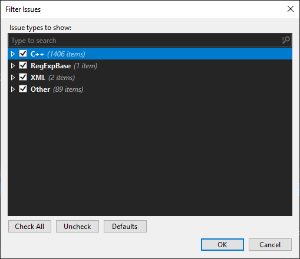
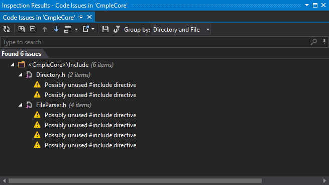
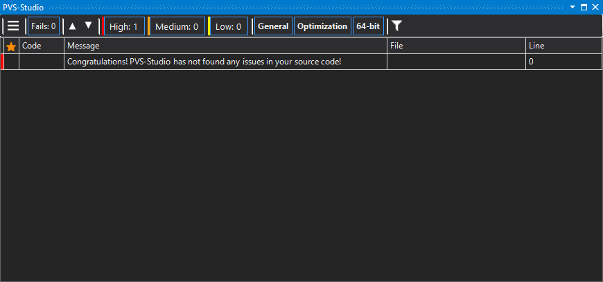
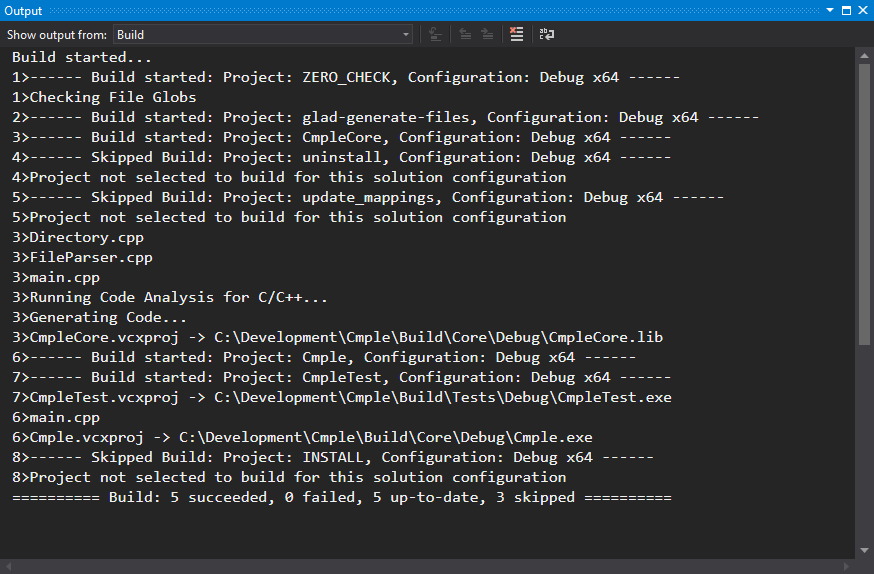
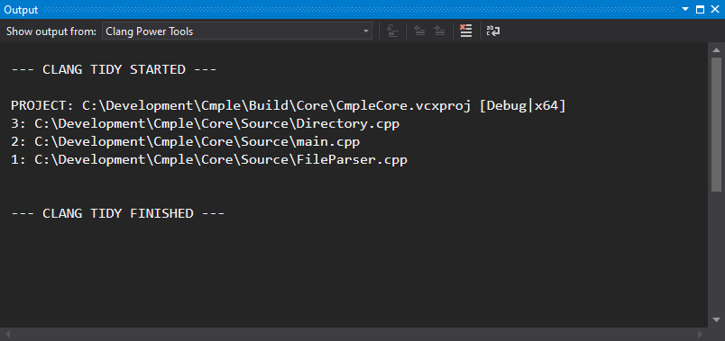
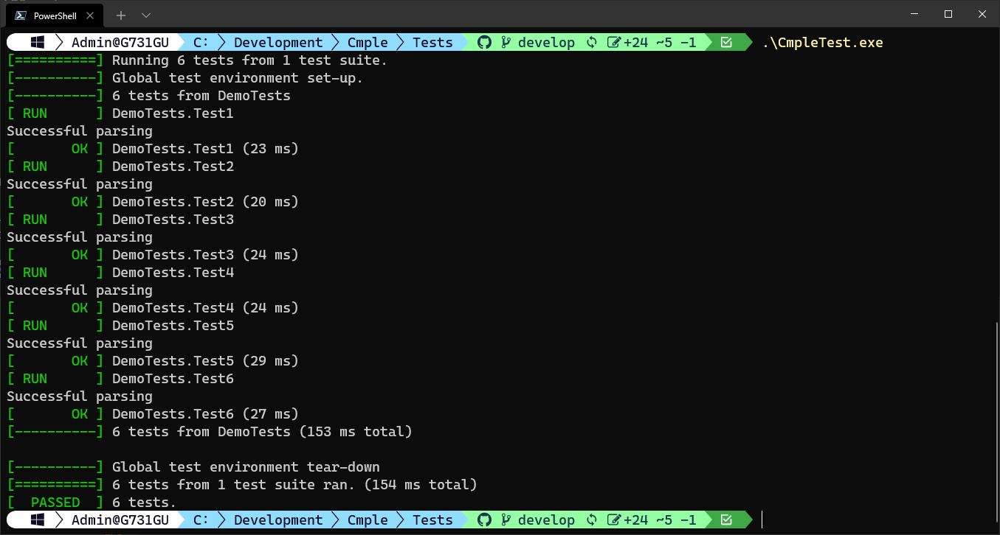

# Cmple #
A code preprocessor/generator for C++ cross-platform projects.

This utility transforms simplified C++ source code files into fully-functional code units ready for compilation including linking graphical API (such as OpenGL) and related submodules.

### Why this name ###
Comes from "C" and "Simple"

## Table of Contents
- [Cmple: Overview](#cmple)
- [Table of Contents](#table-of-contents)
- [Current status](#current-project-status)
- [Project Requirements](#project-requirements)
  - [Glossary](#glossary)
  - [Stakeholders](#stakeholders)
  - [User stories](#user-stories)
  - [Non-functional requirements](#nonfunctional-requirements)
- [Repository structure](#repository-structure)
- [Features](#features)
- [Getting Started](#getting-started)
  - [Quick Start: Windows](#quick-start-windows)
  - [Quick Start: Unix](#quick-start-unix)
- [Examples](#examples)
- [Contributing](#contributing)
- [License](#license)

## Current project status ##
File parser is provided. Missing functions are automatically filled. Interface and implementation code are split into appropriate file types. Header inclusion system enabled. Memory subsystem is injected.

Graphical features are supported for windows creation, basic rendering, input processing.

## Project requirements ##
### Glossary ###
Term | Description
---- | -----------
File converter | A program that converts code written in simplified language to C++ code.
Wrapper | A tool that converts signature of function written in simplified language to syntactically correct C++ function.
Dependency | A relationship of types or objects, between different files
Toolchain | A set of programs used one after another to produce a final program out of code files.
Visibility | A space in code, where a variable or type can be accessed.
Resolver | A function that gives access to objects through a specific identifier.

### Stakeholders ###
Name | Duty | Roles | Responsibilities
---- | ---- | ----- | ----------------
Igor Parfenov | Main developer | Programmer, debugger, testing | Write code, debug code, test code
Anton Dospekhov | Product Manager | Programmer, QA engineer | Write code, check other platforms compatibility, delivery management, user experience design, documentation, git repository management

### User stories ###
Title | Story
----- | -----
C++ file converter | As a developer, I want to be able to write simple script code, so the program converts my simple source files into complete C++ files
Check syntax correctness | As a developer, I want to be able to be sure that input code has correct syntax, so the compiler would get valid files to compile.
Function wrapper | As a developer, I want my functions to have consistent signatures, so the wrapper should check declaration and naming rules.
Class wrapper | As a developer, I want my classes to have consistent structure, so the wrapper should check the interface of the declared class.
Dependency manager | As a developer, I want all libraries and modules to be imported automatically, so the program would create and manage required header files.
Toolchain manager | As a developer, I want to automate compilation of code, after successful processing, so the tool would call the compiler tool chain with required arguments.
Visibility resolver | As a developer, I want the system to automatically manage access to the code interface, so the system would put appropriate access specifiers automatically.
Memory management system | As a developer, I don’t want to manually manage memory and resources, so the system would inject simplified automatic memory allocation and release utility.

### Non-functional requirement ###
Category | Requirement | Actions to achieve
-------- | ----------- | ------------------
Performance Efficiency | Resource Utilization | Create the system to manage memory and keep track of the memory allocations and deallocations for objects of classes.
Usability | Learnability | Create a manual and example file.
Usability | User error protection | Write a delegator that would pass input to the syntax checking tool to ensure primary correctness.
Compatibility | Interoperability | The utility will be a console application, so it would be platform independent.
Maintainability | Testability | We will include an option to enable debugging symbols.

## Features ##
- C++ file converter: program converts simple source files into complete C++ files
- Syntax correctness check.
- Function wrapper: The wrapper checks declaration and naming rules.
- Class wrapper: The wrapper checks the interface of the declared class.
- Dependency manager: All libraries and modules to be imported automatically, so the program creates and manages required header files.
- Toolchain manager: tool calls the compiler toolchain with required arguments.
- Visibility resolver: The system automatically manages access to the code interface.
- Memory management system: The system injects simplified automatic memory allocation and release utility.

## Repository structure ##
Cmple project is implemented in C++. The directory structure follows universal CMake pattern:

	/Build          Binary & Intermediate files (by CMake)
    /Core		    Cmple source code
        /Include    Header public files
        /Source     Source code private files
	/ThirdParty 	Third-party libraries
	/Tests		    Test subproject
	/Examples	    Example project inputs & outputs


## Getting Started ##

### Quick Start: Windows ###

Prerequisites:
- Windows 10 or newer
- Git version 2.22 or newer
- CMake version 3.15 or newer
- C++ build environment as one of:
    - Visual Studio 2019 with all following options:
        - Desktop Development for C++
        - C++ CMake tools for Windows
        - Test Adapter for Google Test (for tests)
        - C++ Clang tools for Windows (optional)
        - LLVM suite for ClangCL builds (optional)
    - MingGW64
        - LLVM suite for Clang builds (optional)

First, download the repository with the following command:
```
> git clone --recursive https://github.com/TonyDecvA180XN/Cmple <where_to_clone>
```
It will grab all included libraries with it. However, if you already cloned it without recursive mode, you can download required modules by running `Install.bat` script.

Every time you need to change compiler suite or your project structure is messed up, use `Clean-Project.bat`

Build process relies on CMake, so make sure all your desired compile environment are visible to it. You can check available generators by running `cmake --help` and examining the trailing section.

To build the project you need run appropriate batch script, as for Windows, one of the:
- `Build-Windows-Clang.bat` for Clang compiler with MinGW build system
- `Build-Windows-ClangCL.bat` for Clang compiler with Microsoft Build system
- `Build-Windows-GCC.bat` for MinGW compiler
- `Build-Windows-MSVC.bat` for Microsoft Visual C++ compiler

First build takes a lot time since it has to build all the libraries included in project.

By default, tests are built with the project, to disable it change in `CMakeLists.txt` in the root folder the following line:
```
set(ENABLE_TESTS ON CACHE BOOL "Build tests" FORCE)
```
to
```
set(ENABLE_TESTS OFF CACHE BOOL "Build tests" FORCE)
```

All executable are stored inside `Build/` folder. Main executable is in `Build/Core/` (or in `Build/Core/Debug/` if you used "MSVC" compiler).
Test executable is in `Build/Tests/` (or in `Build/Tests/Debug/` if you used "MSVC" compiler).

Visual Studio automatically grabs test 

### Quick Start: Unix ###

Prerequisites:
- Git version 2.22 or newer
- CMake version 3.15 or newer
- GCC version 8 or newer
- LLVM for Clang builds (optional)

First, download the repository with the following command:
```
> git clone --recursive https://github.com/TonyDecvA180XN/Cmple <where_to_clone>
```
It will grab all included libraries with it. However, if you already cloned it without recursive mode, you can download required modules by running `bash Install.sh` script.

Every time you need to change compiler suite or your project structure is messed up, use `bash Clean-Project.sh`

Build process relies on CMake, so make sure all your desired compile environment are visible to it. You can check available generators by running `cmake --help` and examining the trailing section.

To build the project you need run appropriate batch script, as for Unix, one of the:
- `Build-Linux-Clang.bat` for Clang compiler with GCC build system
- `Build-Linux-GCC.bat` for GCC compiler

First build takes a lot time since it has to build all the libraries included in project.

By default, tests are built with the project, to disable it change in `CMakeLists.txt` in the root folder the following line:
```
set(ENABLE_TESTS ON CACHE BOOL "Build tests" FORCE)
```
to
```
set(ENABLE_TESTS OFF CACHE BOOL "Build tests" FORCE)
```

All executable are stored inside `Build/` folder. Main executable is in `Build/Core/`.
Test executable is in `Build/Tests/`.

## Code quality ##
### Video demo ###
[](http://www.youtube.com/watch?v=VaRLXqnf4Ms "Video Title")
### Code analysis ###
During development the latest/safest modern C++ techniques were used. To ensure For C++ code analysis in this project several linters (static code analysis tools):
- JetBrains Resharper++ Code Inspection


- PVS-Studio

- Microsoft Visual C++ Code Analysis Tool (with Recommended Native C++ Ruleset)

- Clang-Tidy as part of LLVM


### Testing ###
Testing is performed using GTest library. We test by feeding test input to the tool and comparing it with the expected output.


## Contributing ##

Cmple is an open source project, and is thus can be built with your contributions.

Here are main contributors of the project:
- [Anton Dospekhov](https://github.com/TonyDecvA180XN)
- [Parfenov Igor](https://github.com/ParfenovIgor)

## License ##

The code in this repository is licensed under the [MIT License](LICENSE.txt).
